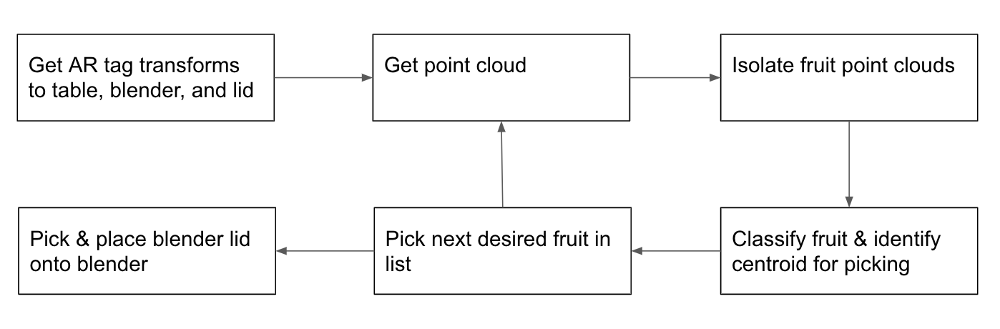

# Design
{:.no_toc}

## Table of contents
{: .no_toc .text-delta }

1. Design
{:toc}

---

## Design

The required design criteria our project must meet includes: identify fruits on a table, determine the best gripper position to pick up desired fruit, move fruit to blender without dropping it, place fruit into the blender, repeating for other desired fruit, closing blender lid.

To implement this, we implemented the following block diagram in our code:

To first start the system, we decided retrieving the transforms was critical to picking and placing the fruit. This consisted of finding the transforms between the RealSense and the table and between the table and Baxter’s ‘base’ frame. We could now place the fruit anywhere in view of the RealSense camera, which would get the point clouds of the fruits using the depth camera, then chain and apply these transforms to get our point cloud in the reference frame of baxter. 

For the classification task, we first researched ways to incorporate transfer learning with pre-trained CNN models and apply image classification to our fruits. However, we realized that in order to tailor the model for our lab environment with fake fruit, we’d need to build a large dataset to re-train the model. This seemed like overkill, so we turned to a much simpler method that relies on Principal Component Analysis(PCA) and RGB analysis. This provided an efficient, quick-to-build solution for fruit classification that really only depends on fruit shape and fruit color. In the real world, the fruit won’t be as perfectly colored and shaped like the fake fruit we were using, so spending extra time to train a robust CNN is definitely the answer for effective fruit classification. Because we wanted to make our system robust to any changes in the environment(e.g. Baxter colliding into one of the fruits while executing a separate path plan), we refiltered and reclassified the point cloud after each time we finished picking a desired fruit, although it required more time for an already slow process. Once we were able to pick all the fruit following the user-input recipe, we would close the lid using the transforms we retrieved in the first step, and implement standard path planning.

In addition, we also had to make adjustments to Baxter’s grippers and the fruit in order to ensure there was enough friction such that the fruit would be picked up, and that the fruit was the right diameter that could fit into the gripper. In order to do so, we added rubber bands to Baxter’s grippers, and flattened out some of the wider fruits (apples, oranges) so that they could fit into Baxter’s grippers. Although we had to sacrifice some real-world variability in fruits, we wanted to verify that our algorithm, when implemented, would work with real data. In order to make it more robust, it would be beneficial to have a gripper that could open and close fully instead of the discrete levels of maximal opening as on the Baxter’s grippers.

