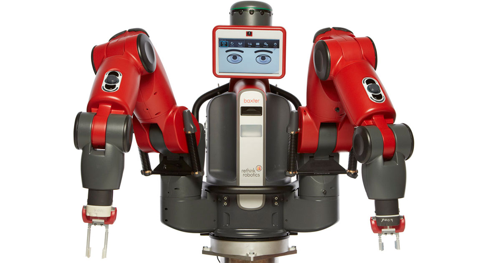

# Smoothie Bot
{: .mb-2 }
EECS 106A, Fall 2019 
{: .mb-0 .fs-6 .text-grey-dk-000 }

Picture this: It’s a hot, summer afternoon, you’ve just finished playing soccer with your kid. The heat has withered away your energy, and the thirst in your mouth is quite unbearable. The thought pops up in your conscience,"damn, a smoothie sounds sooo freaking good right about now, but Jamba Juice is oh so far!" Enter, your own personal SmoothieBot - capable of freshly blending any smoothie of your heart’s desire,right in the comfort of your home - with no effort required!
